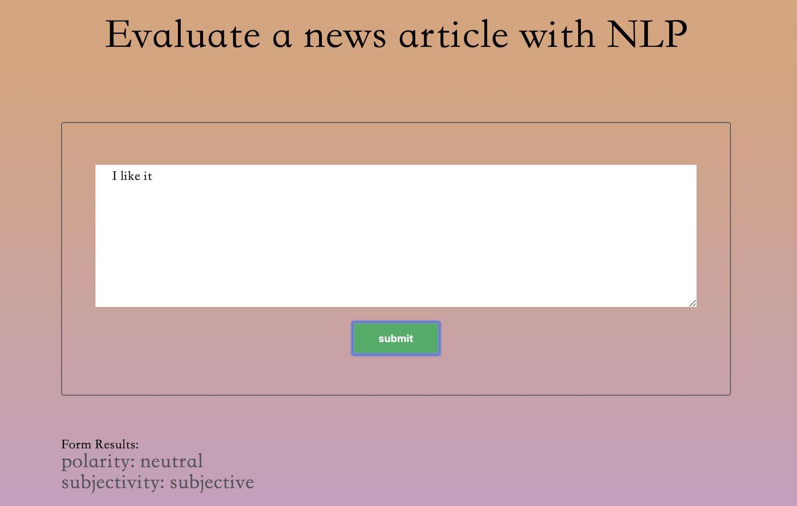

# Project Name

Evaluate a news article with Natural Language Processing

### Introduction

This is an exercise for webpack. I made a web tool that allow users to get the semantic result of the text he inputs, by using a NLP API.

### API used
Aylien Text Ananlysis API
The document of this API is https://docs.aylien.com/tap/

### demo

